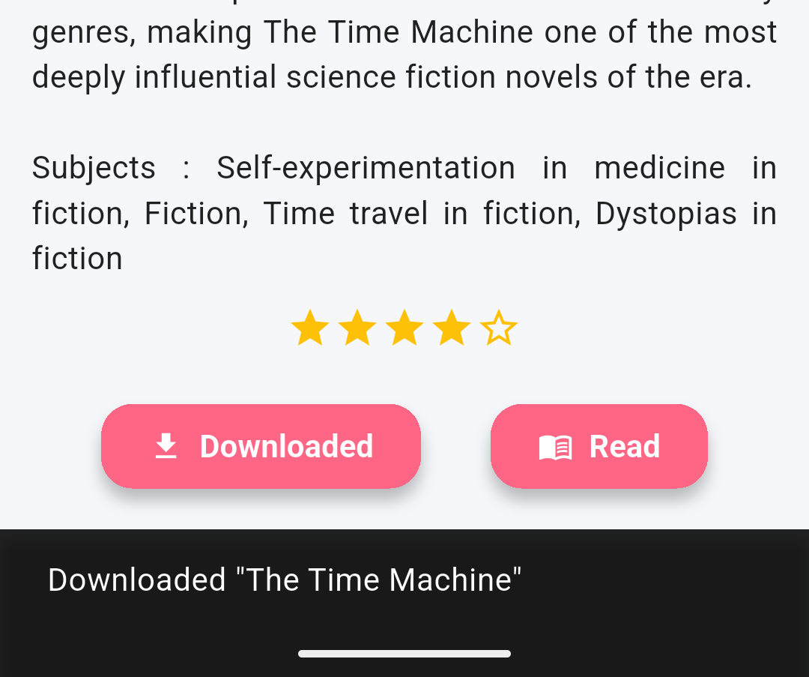
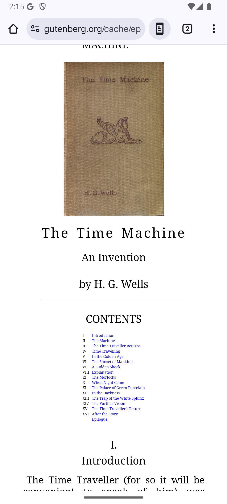

# Smart Ebook Library

### Project Overview 
Free eBook library app is a simple, elegant, and functional mobile application built with Flutter. The app allows users to browse, read, and download public domain eBooks books whose copyrights have expired and completely free to use.

All books are sourced from trusted public archives like https://openlibrary.org/subjects/pictures , https://www.gutenberg.org/ 

### Key Features

📚 **Book Library**: Curated list of classic public domain books.

📖 **Book Details Page**: View descriptions, authors, and download options.

📥 **Download eBooks**: Download and Read books in the application.

🖼️ **Cover Images**: Book covers displayed using Open Library or Project Gutenberg covers.

📱 **Responsive UI**: Designed with Flutter for smooth performance across Android devices.

🌐 **Link to Source**: Direct links to Project Gutenberg downloads.

### Technology Stack
🧱 **Flutter**: The app is built using the Flutter framework, which uses the Dart programming language to create natively compiled applications for mobile, web, and desktop from a single codebase.   
💻 **Dart**: The programming language used for Flutter development.   
🌐 **url_launcher**: A Flutter package used to launch URLs in the mobile platform's default browser or external applications.   
🎨 **Material Design**: The app UI is designed using Flutter's Material Design components for a modern and responsive user interface.   
🖥️📱 **Platform Support**: The app supports multiple platforms including Android, iOS, macOS, Windows, and Linux, leveraging their respective SDKs.   
📚 **Public Domain eBook Sources**: The app sources eBooks from trusted public archives such as Open Library and Project Gutenberg.   
📱💡 **Android Studio Virtual Device**: Used for running and testing the app on Android emulators during development.   

### Screenshots of UI
**Home Page**  

**Book Detail page**  

**Download notify msg**  

**Download page**  

**Search enginee**  

**Ebook Reader**  

